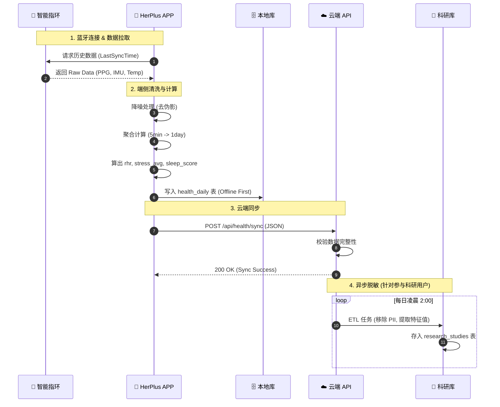
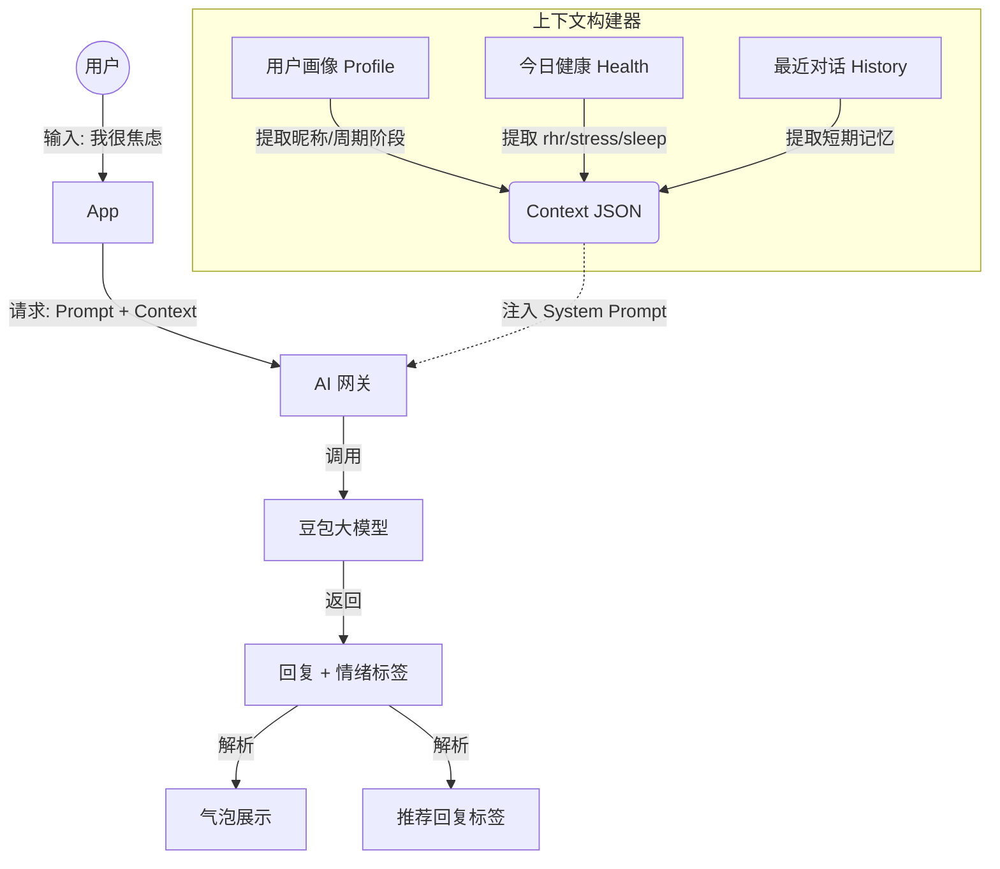
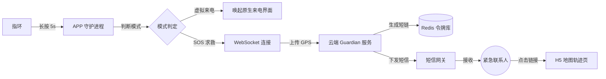

---

**文档文件名**: `docs/data-specs-and-flows.md`

# HerPlus 数据流与详细数据规范

| 文档属性 | 内容 |
| :--- | :--- |
| **项目名称** | HerPlus 智能戒指 APP |
| **版本号** | v1.0 (Data Specs) |
| **关联文档** | Architecture v1.0 |
| **用途** | 指导开发进行数据埋点、ETL 开发及接口字段映射 |

---

## 1. 核心数据流视图 (Core Data Flows)

### 1.1 硬件数据同步闭环 (The Sync Loop)
展示数据从指环传感器采集，到端侧清洗计算，最后上云存储的全过程。



### 1.2 AI 上下文构建流 (AI Context Flow)

展示“对话舱”如何将用户当前的生理状态转化为 Prompt 上下文，实现“懂你”的对话。



### 1.3 Guardian 紧急信令流 (Emergency Signal Flow)

展示长按指环触发 SOS 的软硬结合流程。



---

## 2. 详细数据字典 (Data Dictionary)

本节对 `architecture.md` 中的 Schema 进行**业务级**的详细解释。

### 2.1 用户基础画像 (`users` 表扩展说明)

| 字段名 (Snake Case) | 类型 | 单位/格式 | 来源 | 业务逻辑说明 |
| --- | --- | --- | --- | --- |
| `user_id` | UUID | - | 系统生成 | 全局唯一 ID。 |
| `is_onboarding_completed` | Bool | - | APP | **关键状态位**。`false`=强制进向导；`true`=进首页。 |
| `height_cm` | Numeric | cm | 用户输入 | **计算基准**。用于 BMR (基础代谢) 和步长估算。 |
| `weight_kg` | Numeric | kg | 用户输入 | **计算基准**。用于卡路里消耗计算。 |
| `cycle_length_days` | Int | 天 | 用户输入 | 默认 28。用于预测下次经期/排卵期。 |
| `is_research_active` | Bool | - | 设置开关 | `true` 时，数据会被 ETL 任务抓取并脱敏。 |

### 2.2 每日健康指标 (`health_daily` 表扩展说明)

这是 App 首页和图表页的核心数据源。

| 字段名 | 业务名称 | 单位 | 范围 | 计算/采集逻辑 |
| --- | --- | --- | --- | --- |
| `readiness_score` | **身心准备度** | 分 (0-100) | 0-100 | **公式**: `0.4*Sleep + 0.4*(100-Stress) + 0.2*RHR因子`。<br>

<br>85+ 为优秀，60- 为疲劳。 |
| `sleep_score` | 睡眠评分 | 分 (0-100) | 0-100 | 基于深睡占比、总时长、清醒次数加权计算。 |
| `rhr` | **静息心率** | bpm | 30-120 | 取睡眠期间心率最低的 30 分钟平均值。 |
| `stress_avg` | 平均压力值 | - | 1-100 | 基于 HRV (心率变异性) 反向映射。<br>

<br>1-25(放松), 26-50(正常), 51-75(中等), 76+(高压)。 |
| `skin_temp_delta` | **体温偏差** | °C | ±3.0 | 相对基准线的偏差值。**排卵后会持续升高 0.3-0.5°C** (Dip 识别依据)。 |
| `daily_steps` | 总步数 | 步 | 0+ | 指环加速度计采集。用于公益能量转换 ($1/10k步)。 |
| `sleep_stages_summary` | 睡眠结构 | JSON | - | 格式示例：`{"deep": 45, "light": 200, "rem": 85, "awake": 15}` (分钟)。 |

### 2.3 AI 会话数据 (`ai_sessions` & `ai_messages`)

用于还原对话场景和上下文回溯。

| 字段名 | 说明 | 示例值 | 用途 |
| --- | --- | --- | --- |
| `session_type` | 会话模式 | `"HOME"` / `"EXPERT"` | 首页对话舱比较随意；专家模式会有特定的人设 Prompt。 |
| `context_snapshot` | **上下文快照** | `{"rhr": 72, "stress": 85}` | **审计关键**。记录AI给出建议时，用户的生理状态是什么，防止“胡乱建议”。 |
| `sentiment_tag` | 情绪标签 | `"Anxious"`, `"Joyful"` | AI 分析用户输入后的自动打标，用于生成“情绪月报”。 |
| `round_count` | 轮次计数 | `5` | 每日限制 10 轮。达到上限后前端提示“今日额度已尽”。 |

### 2.4 公益捐赠数据 (`charity_contributions`)

确保每一笔“能量注入”都可追溯。

| 字段名 | 说明 | 逻辑规则 |
| --- | --- | --- |
| `steps_donated` | 捐赠步数 | 每次点击“注入”时的 `current_steps - last_donated_steps`。 |
| `currency_value` | 折算金额 | 后端配置汇率。当前标准：`10,000 steps = $1.00`。 |
| `project_id` | 项目 ID | 必须对应 `charity_projects` 表中的有效 ID。 |

---

## 3. 数据状态机 (Data State Machines)

### 3.1 首页状态展示逻辑 (Moment UI Logic)

首页的 UI 状态（Moment 卡片）严格依赖以下数据组合：

| 场景 | 数据条件 (AND 逻辑) | UI 表现 | 文案示例 |
| --- | --- | --- | --- |
| **需要充电** | `battery_level < 20%` | 顶部出现红色电量条 | "Ring needs energy too." |
| **正在同步** | `sync_status == "SYNCING"` | 漩涡加速旋转 | "Syncing your rhythm..." |
| **高压预警** | `stress_avg > 75` | 漩涡变红且脉冲急促 | "Take a deep breath." |
| **经期将至** | `days_to_period <= 2` | 出现粉色水滴图标 | "Cycle arriving soon." |
| **数据不足** | `is_new_user == true` OR `wear_time < 24h` | 漩涡显示为灰色 | "Wear ring to unlock insights." |

### 3.2 离线数据策略 (Offline Policy)

由于使用了 `WatermelonDB`，App 遵循“离线优先”原则。

1. **写入**: 所有的传感器数据、日记记录先写入本地 SQLite。
2. **队列**: 写入动作进入 `SyncQueue`。
3. **触发**: 网络恢复 (`ConnectivityChanged`) 或 App 启动时，处理队列。
4. **冲突**: 以**服务端时间戳**为准（Last Write Wins），但保留本地未同步的草稿。

```

***

### 💡 架构师 Winston 的备注

这份文档补充了架构设计中“肉眼看不见”的流动部分。

* **对于前端开发**：`1.2 AI 上下文流` 和 `3.1 首页状态展示逻辑` 是他们最需要的，直接决定了 UI 怎么写。
* **对于后端开发**：`1.1 同步闭环` 和 `2.2 详细字典` 是 API 开发和数据库建表的红宝书。
