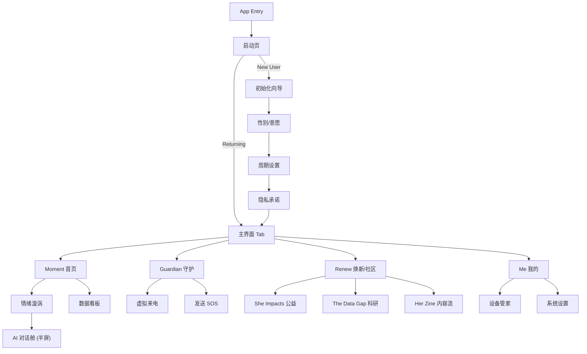

# HerPlus UI/UX 规格说明书 (UI/UX Specification)

| 文档属性       | 内容                 |
| :------------- | :------------------- |
| **项目名称**   | HerPlus 智能戒指 APP |
| **版本号**     | v1.0                 |
| **状态**       | **已定稿**           |
| **最后更新**   | 2025-01-08           |
| **设计负责人** | Sally (UX Expert)    |

---

## 1. 引言 (Introduction)

本设计规范旨在确立 HerPlus 的视觉语言与交互标准。我们的核心设计理念是 **"Borderless, Soft & Healing" (无边框、柔和、疗愈)**。

区别于传统健康应用的冷峻科技感，HerPlus 采用**暖感疗愈**的美学风格，通过高明度、低饱和的色彩与流畅的微交互，为女性用户提供如“第二层肌肤”般无压力的数字体验。

### 1.1 核心体验原则
1.  **Visually Soft (视觉柔和)**: 拒绝纯黑背景与锐利直角，所有卡片采用大圆角（24pt+），色彩如水彩般晕染。
2.  **Emotionally Resonant (情感共鸣)**: 首页不展示冷冰冰的数据表格，而是通过“多态漩涡”让用户直观感知情绪流动。
3.  **Safe & Private (安全私密)**: Guardian 模式下的界面需具备极强的隐蔽性与操作确定性。

---

## 2. 视觉设计系统 (Visual Design System)

### 2.1 色彩体系 (Color Palette)
采用“暖感疗愈”配色方案。严禁使用纯黑 (#000000)，仅在视频遮罩或极高对比度需求下例外。

| 色彩名称                | Hex 值    | 用途说明                                         |
| :---------------------- | :-------- | :----------------------------------------------- |
| **Primary (主色)**      |           |                                                  |
| **Teal**                | `#00ADB5` | 主按钮、选中态、高亮链接、关键行动点。           |
| **Deep Teal**           | `#008C93` | 主按钮按下态 (Pressed)。                         |
| **Pale Aqua**           | `#DFF4F5` | 辅助底色、轻量标签背景。                         |
| **Secondary (辅助色)**  |           |                                                  |
| **Dusty Rose**          | `#E8C4C4` | 经期/女性健康模块主色、大面积柔和背景。          |
| **Cream**               | `#FDEBD6` | 全局背景色 (代替纯白)，营造纸质温暖感。          |
| **Pale Rose**           | `#F5E1E1` | 卡片底色、次级背景。                             |
| **Functional (功能色)** |           |                                                  |
| **Coral**               | `#FD5369` | **重要/警示** (如压力过高)，避免过于刺眼的纯红。 |
| **Deep Coral**          | `#E24B5E` | **紧急/错误** (如低电量、SOS 触发)。             |
| **Shell Pink**          | `#FDE3E7` | 错误提示背景。                                   |
| **Neutral (中性色)**    |           |                                                  |
| **Charcoal**            | `#2F2E2B` | 主标题、正文 (代替纯黑)。                        |
| **Taupe**               | `#6B6661` | 次级文字、说明文案。                             |
| **Warm Gray**           | `#D9D2CC` | 分割线、未选中图标、置灰文字。                   |
| **Ivory**               | `#EFE9E4` | 输入框背景、极淡分割区。                         |

### 2.2 排版 (Typography)
遵循“纯净 (Clean)”原则，使用系统原生字体以确保最佳性能与多语言适应性。

* **iOS**: SF Pro Display / Text
* **Android**: Roboto / Noto Sans

| 样式层级           | 字号 (pt/sp) | 字重 (Weight) | 行高 (Line Height) | 场景示例                    |
| :----------------- | :----------- | :------------ | :----------------- | :-------------------------- |
| **H1 Hero**        | 32           | Bold          | 1.2                | 首页核心数值、启动页 Slogan |
| **H2 Title**       | 24           | Semibold      | 1.3                | 页面大标题                  |
| **H3 Section**     | 18           | Medium        | 1.4                | 模块/卡片标题               |
| **Body Primary**   | 16           | Regular       | 1.5                | 正文、对话舱内容            |
| **Body Secondary** | 14           | Regular       | 1.5                | 辅助说明、列表项            |
| **Caption**        | 12           | Regular       | 1.4                | 底部标签、图表刻度          |
| **Button**         | 16           | Semibold      | 1.0                | 按钮文字 (字间距 +0.5)      |

### 2.3 图标与圆角 (Iconography & Radius)
* **图标风格**: **Rounded Stroke (圆润描边)**。线条末端为圆形 (Round Cap)，线宽统一为 **1.5px**。选中态可使用填充风格 (Filled)。
* **圆角规范**:
    * **卡片 (Card)**: `24px` (大卡片) / `16px` (次级卡片)。
    * **按钮 (Button)**: `24px` (全圆角/胶囊形)。
    * **弹窗 (Modal)**: `24px` (顶部圆角)。

---

## 3. 核心组件规范 (Core Components)

### 3.1 导航 (Navigation)
* **底部标签栏 (Tab Bar)**:
    * **背景**: 高斯模糊 (Blur) + 80% 透明度 Cream。
    * **图标**: 选中为 Teal 实心，未选中为 Warm Gray 描边。
    * **结构**: `Moment`(首页) - `Guardian`(守护) - `Renew`(焕新) - `Me`(我的)。
    * **特殊**: Guardian 图标需稍大，位置居中（或在视觉上强调），便于紧急点击。

### 3.2 卡片 (Cards)
* **风格**: 无边框 (Borderless)，通过微弱的 **投影 (Shadow)** 和 **色块区分** 建立层级。
* **阴影**: `0px 4px 12px rgba(47, 46, 43, 0.05)` (极为柔和，仅营造悬浮感)。
* **间距**: 模块间距 `16px`，页面边距 `20px`。

### 3.3 多态漩涡 (Multimorphic Vortex) - *核心视觉*
首页的情绪可视化引擎，需通过 WebGL 或 Lottie 实现。
* **状态 A (Relaxed)**: 颜色 `Pale Aqua` + `Cream`，形态为缓慢、舒展的圆形波纹，FPS 30。
* **状态 B (Balanced)**: 颜色 `Dusty Rose` + `Teal`，形态为平稳流动的莫比乌斯环，FPS 45。
* **状态 C (Stressed)**: 颜色 `Coral` + `Deep Coral`，形态为略带棱角的收缩/脉冲运动，FPS 60。

---

## 4. 触感设计 (Haptic Design) ✨ *新增章节*

利用指环和手机的线性马达，建立触觉反馈语言。

| 场景             | 触感类型 (Haptic Type) | 强度/模式              | 意图                                 |
| :--------------- | :--------------------- | :--------------------- | :----------------------------------- |
| **SOS 触发成功** | **Heavy Impact**       | 强震动 1 次 (500ms)    | 明确告知用户“求救已发送”，无需看屏。 |
| **呼吸练习**     | **Gentle Pulse**       | 渐强-渐弱 (随呼吸节奏) | 引导用户跟随节奏呼吸，产生共鸣感。   |
| **状态切换**     | **Light Tick**         | 极轻微短震 (10ms)      | 如下拉刷新、Tab 切换，提供精致质感。 |
| **异常预警**     | **Rapid Warning**      | 连续短震 3 次          | 提醒心率过高或压力过大。             |

---

## 5. 信息架构 (Information Architecture)

## 6. 详细页面交互规范 (Detailed Page Specifications)

### 6.1 启动与初始化 (Splash & Onboarding)
* **启动视频**:
    * **交互**: 全屏无 UI，视频播放结束前禁止点击跳过。
    * **过渡**: 视频最后一帧淡出 (Fade Out 300ms) 至登录页背景。
* **初始化向导**:
    * **进度条**: 顶部细条 (高度 4px)，颜色 `Teal`，背景 `Ivory`。
    * **选择卡片**: 选项采用大卡片布局，未选状态背景 `White` + 描边 `Warm Gray`；选中状态背景 `Pale Aqua` + 描边 `Teal` + 右上角 `Teal` 对勾图标。
    * **动效**: 点击“下一步”，当前页面向左滑出 (Slide Left)，新页面从右滑入。

### 6.2 首页 (Moment)
* **多态漩涡 (The Vortex)**:
    * **位置**: 屏幕垂直居中偏上。
    * **手势**:
        * **点击**: 漩涡缩小至顶部 (Scale 0.6) + 背景高斯模糊 (Blur 20px) -> 底部升起 AI 对话舱浮层 (Spring 动画)。
        * **下拉**: 触发数据同步，漩涡加速旋转 1s 后恢复。
* **数据卡片**:
    * **布局**: 2x2 网格布局。
    * **心率卡片**: 点击展开为全屏图表页 (Shared Element Transition)，卡片背景色平滑过渡为页面背景色。

### 6.3 AI 对话舱 (AI Chat Overlay)
* **形态**: 半屏浮层 (Height: 70% Screen)，顶部圆角 `24px`。
* **背景**: `Cream` (85% 透明度) + 背景模糊 (Blur)。
* **消息流**:
    * **AI 消息**: 左侧对齐，无气泡背景，文字直接显示，颜色 `Charcoal`。
    * **用户消息**: 右侧对齐，胶囊气泡背景 `Teal`，文字 `White`。
    * **预测标签**: 位于输入框上方，水平滚动。点击后标签变色 (`Deep Teal`) 并飞入消息流。

### 6.4 守护模式 (Guardian)
* **触发态**:
    * **倒计时**: 屏幕中央显示巨大的倒计时数字 (10 -> 0)，颜色 `Deep Coral`，伴随心跳般的震动 (Haptic: Heavy Impact)。
    * **取消**: 底部提供“滑动取消”滑块，防止误触。
* **虚拟来电 (Fake Call)**:
    * **UI 伪装**: 必须 1:1 还原 iOS/Android 原生来电界面（黑色背景、接听/挂断图标位置、字体大小）。**切勿使用 APP 的 Cream 色调**。
    * **头像**: 显示用户预设的头像（如风景、猫咪），避免穿帮。

### 6.5 焕新与公益 (Renew & Global Her)
* **注入能量 (Charity)**:
    * **触发**: 点击“注入”按钮。
    * **反馈**: 按钮缩小 (Scale 0.95) -> 释放粒子特效 (Particles) 飞向顶部的公益项目图 -> 进度条增加 -> 数字滚动更新。
* **文章阅读**:
    * **沉浸模式**: 向上滑动浏览文章时，顶部导航栏和底部 Tab Bar 自动隐去 (Slide Out)；向下滑动时恢复。

### 6.6 我的 (Me)
* **3D 指环**:
    * **交互**: 支持单指水平旋转模型查看细节。
    * **充电态**: 模型周围增加淡淡的 `Teal` 色呼吸光晕 (Glow)。

---

## 7. 动效设计 (Motion Design)

遵循“自然物理 (Natural Physics)”原则，避免生硬的线性运动。

### 7.1 转场 (Transitions)
* **层级进入**: 新页面从右侧滑入 (Slide In Right)，覆盖旧页面，带有轻微视差 (Parallax)。
* **模态弹出**: 底部浮层 (Bottom Sheet) 使用 `Spring` 曲线 (Damping: 20, Stiffness: 300)，带有回弹感。

### 7.2 微交互 (Micro-interactions)
* **按钮点击**: 按下时整体缩小至 95% (Scale Down)，松开回弹。
* **开关 (Toggle)**: 切换时滑块带有“粘性”拖尾效果，背景色从 `Warm Gray` 渐变至 `Teal`。
* **加载**: 避免使用系统菊花图。使用品牌 Logo 的呼吸动画或 `Teal` 色脉冲波纹。

---

## 8. 特殊状态设计 (Special States)

### 8.1 离线/无网络 (Offline)
* **首页**: 漩涡变为灰度 (Grayscale) 并停止旋转，顶部显示“离线模式”小黄条。数据展示本地缓存，无缓存项显示“--”。
* **AI 对话**: 输入框置灰，提示文字变为“网络正在重连...”。

### 8.2 空状态 (Empty States)
* **场景**: 无历史数据、无收藏文章。
* **设计**: 显示插画 (Illustration)而非纯文字。
* **风格**: 线条手绘风格，颜色使用 `Pale Aqua` 和 `Cream`，配文温暖鼓励（如“这里还很空，去创造一点回忆吧”）。

### 8.3 错误与异常 (Error Handling)
* **Toast**: 顶部下滑出现的胶囊提示，背景 `Shell Pink`，文字 `Deep Coral`，左侧带圆型感叹号图标。停留 3s 后自动收起。
* **阻断式弹窗**: 仅用于极严重错误（如账号被冻结）。背景白色，按钮 `Teal`。

---

## 9. 资源交付清单 (Assets Handoff)

请设计团队提供以下切图或源文件：
1.  **Splash Video**: `.mp4` / `.lottie` (1080x1920)。
2.  **Vortex Assets**: `.json` (Lottie) 或 WebGL Shader 代码片段。
3.  **Icons**: `.svg` 格式图标包。
4.  **Illustrations**: 空状态插画 `.png` (3x)。
5.  **Ring Model**: `.glb` / `.gltf` 格式 3D 模型 (低面数优化版)。

---