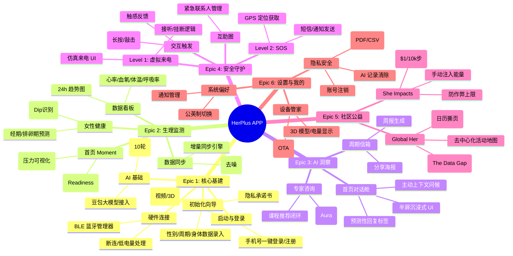

# HerPlus 系统功能与用户旅程蓝图

| 文档属性     | 内容                      |
| :----------- | :------------------------ |
| **项目名称** | HerPlus 智能戒指 APP      |
| **版本号**   | v1.0 (Visualization)      |
| **基于文档** | PRD v1.0, UI/UX Spec v1.0 |
| **作者**     | Analyst (Mary)            |

---

## 1. 系统功能架构图 (System Function Architecture)

这是基于 PRD 六大 Epic 拆解的功能全景图，展示了 APP 的核心能力边界。




## 2. 核心用户旅程 (Core User Journeys)

### 2.1 新用户激活旅程 (The Onboarding Flow)

从首次打开 APP 到进入首页的完整路径，强调“无断点”体验。

```mermaid
graph TD
    Start((用户打开APP)) --> IsNew{是否新用户?}
    
    %% 新用户路径
    IsNew -- Yes --> SplashA[播放真人生活流视频]
    SplashA --> Login[手机号一键登录]
    Login --> WizardStart[进入初始化向导]
    
    subgraph Wizard [初始化数据录入]
        direction TB
        P1[P1: 性别确认] --> P2[P2: 追踪意愿]
        P2 --> P3[P3: 周期详情]
        P3 --> P4[P4: 身体数据]
        P4 --> P5[P5: 隐私承诺]
    end
    
    WizardStart --> P1
    P5 -->|点击开启旅程| BindRing[扫描绑定指环]
    BindRing -->|连接成功| Home((进入首页))
    
    %% 老用户路径
    IsNew -- No --> SplashB[播放 3D Logo 动画]
    SplashB --> AutoSync[后台自动同步数据]
    AutoSync --> Home

### 2.2 每日闭环体验 (The Daily Loop)

用户最典型的一天使用流程：看状态 -> 聊情绪 -> 捐步数。

sequenceDiagram
    participant User as 用户
    participant App as HerPlus APP
    participant Ring as 智能戒指
    participant AI as 豆包大模型
    participant Cloud as 云端/公益库

    Note over User, Ring: 早晨起床
    User->>App: 打开 APP
    App->>Ring: BLE 连接 & 拉取昨晚睡眠/体温数据
    Ring-->>App: 返回数据包
    App->>App: 计算 Readiness Score & Stress Index
    App-->>User: 渲染首页“多态漩涡” (颜色/形态)
    
    Note over User, App: 发现压力值偏高 (Stress > 70)
    User->>App: 点击“漩涡”
    App->>User: 弹出半屏 AI 对话舱
    App->>AI: 发送 Context: "用户刚醒，压力高，睡眠差"
    AI-->>App: 返回主动问候: "昨晚似乎没睡好，是因为焦虑吗？"
    App-->>User: 显示问候 + 预测标签 [赶工期] [身体不适]
    User->>App: 点击 [赶工期]
    App->>AI: 请求安抚建议
    AI-->>User: 返回简短建议 + 呼吸练习推荐
    
    Note over User, App: 晚间回顾
    User->>App: 进入 "Renew" 页面
    App->>App: 结算今日步数 (e.g., 8500步)
    App-->>User: 提示 "待注入能量: $0.85"
    User->>App: 点击 "注入能量"
    App->>Cloud: 上传步数 & 增加公益池金额
    App-->>User: 播放粒子动画 & 更新进度条

### 2.3 安全守护触发流程 (The Guardian Flow)

紧急情况下的软硬结合交互逻辑。

stateDiagram-v2
    state "指环佩戴中" as Wearing
    state "手势识别中" as Listening
    state "震动反馈" as Haptic
    state "APP 决策" as Decision
    state "Level 1: 虚拟来电" as FakeCall
    state "Level 2: SOS" as SOS

    [*] --> Wearing
    Wearing --> Listening
    Listening --> Haptic: 监测到长按 5s
    Haptic --> Decision: 发送 BLE 指令
    
    state Decision <<choice>>
    Decision --> FakeCall: 默认策略 / 设置为脱身
    Decision --> SOS: 设置为紧急求救
    
    state FakeCall {
        等待10s --> 模拟系统来电界面
        模拟系统来电界面 --> 接听: 进入通话计时
        模拟系统来电界面 --> 拒绝: 退出
    }
    
    state SOS {
        获取GPS --> 生成短链
        生成短链 --> 尝试后台发短信
        尝试后台发短信 --> 失败: 推送高优通知
        失败 --> 用户点击通知: 跳转短信页
        尝试后台发短信 --> 成功: 静默完成
    }


## 3. 数据与业务实体关系图 (Conceptual ER Diagram)

为了辅助架构师进行数据库设计，梳理了核心业务实体的逻辑关系。

erDiagram
    User ||--|| RingDevice : binds
    User ||--|| UserProfile : has
    User ||--o{ HealthDailyData : generates
    User ||--o{ AIChatSession : participates
    User ||--o{ CharityContribution : donates
    User ||--o{ EmergencyContact : manages

    UserProfile {
        string gender
        date dob
        float height
        float weight
        int cycle_length
        boolean is_research_active
    }
    
    HealthDailyData {
        date date
        int readiness_score
        float stress_avg
        int steps_total
        json sleep_stages
        float rhr
        float skin_temp_delta
    }
    
    AIChatSession {
        string session_id
        string type "HOME | EXPERT"
        int round_count
        timestamp created_at
        string context_snapshot
    }
    
    CharityContribution {
        date date
        int steps_donated
        float currency_value
        string project_id
    }
